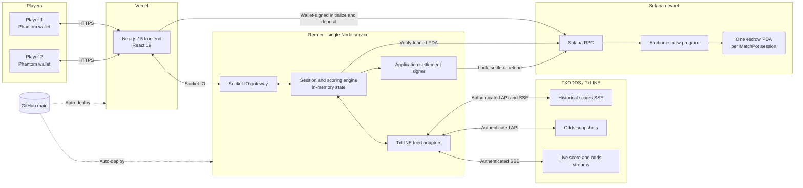

# MatchPot ⚽🏆

> Live, odds-powered prediction battles for the FIFA World Cup.

[**Play the live demo**](https://tx-odds-hack-web.vercel.app/) · [TXODDS / TxLINE](https://txline-docs.txodds.com/documentation/quickstart) · [Solana program on devnet](https://explorer.solana.com/address/Diu1knrbYFraN5oSzjEW2RBjRW1obVo2iNz7vHDVrLET?cluster=devnet)

MatchPot turns a football match into a fast social prediction game. Two friends join a session, lock SOL into a shared prize pool, and answer in-play questions such as **“Who scores the next goal?”** Correct calls earn points using the TXODDS price captured when the prediction is submitted. At full time, the highest score wins the pot and the application settles it automatically through an Anchor program on Solana.

Built at the **TXODDS World Cup Hackathon at Encode Hub** for the consumer and fan experiences track.

> The hosted backend uses a free Render instance and can take up to a minute to wake after being idle. For the quickest first look, choose a historical match and play **Practice free vs MatchBot**—no wallet or SOL required.

## Why MatchPot?

Watching football is already social; MatchPot gives every passage of play a small competitive stake. It uses TXODDS data for more than a scoreboard:

- Historical TxLINE event data powers faithful, accelerated World Cup replays.
- In-running TXODDS prices determine the points available for next-goal predictions.
- Live score and odds streams are routed automatically for scheduled fixtures.
- Odds are captured at submission time, so a difficult early call is worth more than an obvious late one.
- Goals, cards and corners resolve open questions against the real match feed.

The result is a short, understandable game loop that demonstrates how official sports data can create a new fan experience rather than simply reproduce a betting screen.

## Demo modes

| Mode | Players | Wallet | Prize pool | Data |
|---|---:|---|---|---|
| **Competitive replay** | 2 | Phantom | 0.1 devnet SOL each | Recorded TxLINE events and historical odds |
| **Free practice** | Player vs MatchBot | Optional | None | Same replay, questions and scoring |
| **Upcoming live match** | 2 | Phantom | Opens 15 minutes before kickoff | TxLINE live score and odds streams |

The curated demo catalogue contains four verified historical fixtures plus the World Cup third-place play-off and final as scheduled fixtures. Fixture selection is the source of truth: users run one app and one command; the server chooses the correct historical or live TxLINE adapter automatically.

## How a game works

1. The host selects a fixture and creates a session.
2. A friend joins using the four-character code or QR invitation.
3. In competitive mode, each wallet deposits **0.1 SOL** into that session's unique escrow PDA.
4. At kickoff, the server verifies every depositor and irreversibly locks the pool.
5. Prediction questions appear throughout the match and remain open for 12 match minutes.
6. Answers lock with the current TXODDS price and resolve on the next matching event.
7. At full time, the highest score wins. Ties split the pool; if everyone scores zero, every entry is refunded.
8. The application submits settlement and the UI links to the resulting Solana transaction.

### Scoring

| Question | Resolution source | Points |
|---|---|---:|
| Who scores the next goal? | Next goal in the TxLINE feed | `100 × captured TXODDS price` |
| Which team gets the next card? | Next yellow or red card | 150 |
| Which team wins the next corner? | Next corner | 150 |

Next-goal prices are clamped between **1.05× and 6.00×** so a single long-shot prediction cannot decide the entire match. Unresolved questions are voided at full time.

## Infrastructure



### Runtime responsibilities

- **Next.js frontend:** wallet connection, fixture selection, session UX, predictions, live odds, QR invites and settlement receipts.
- **Socket.IO server:** lobby membership, reconnection, question scheduling, score calculation and winner selection.
- **TxLINE adapters:** historical SSE parsing, historical odds sampling, accelerated replay, and live score/odds streaming.
- **Anchor program:** session escrow creation, deposits, irreversible kickoff lock, winner payout, tie splitting and refunds.
- **Shared package:** fixture catalogue, Socket.IO contracts and session/event types used by both frontend and server.

Sessions currently live in one server process and are intentionally ephemeral for the hackathon demo. This is why the Socket.IO backend runs as a single long-lived Render service rather than independently scaled serverless functions.

## TXODDS integration

Historical fixtures use the recorded scores endpoint at `/scores/historical/{fixtureId}`. MatchPot maps kickoff, goals, cards, corners, half-time, full-time and selected commentary into a common event model. It samples `/odds/snapshot/{fixtureId}?asOf=...` across the match, then replays the combined timeline at one match minute per tick.

Upcoming fixtures use the score and odds streams directly. Participant 1 maps to the home side and participant 2 to the away side, while the rest of the application uses stable `HOME` and `AWAY` identifiers. This keeps game logic independent of any particular country or fixture.

For next-goal scoring, MatchPot prefers a dedicated next-goal market when present. Its fallback derives a two-team probability from the demargined in-running 1X2 market, excluding the draw, and applies the gameplay cap described above.

## Solana escrow

The deployed Anchor program is reusable across sessions:

| Item | Devnet address |
|---|---|
| Program | [`Diu1knrbYFraN5oSzjEW2RBjRW1obVo2iNz7vHDVrLET`](https://explorer.solana.com/address/Diu1knrbYFraN5oSzjEW2RBjRW1obVo2iNz7vHDVrLET?cluster=devnet) |
| Settlement authority | [`6XYhnadptgK7a9UpC44XeKcWefX1pEuZHGkYHHUPE6Uj`](https://explorer.solana.com/address/6XYhnadptgK7a9UpC44XeKcWefX1pEuZHGkYHHUPE6Uj?cluster=devnet) |

Every game receives a random 32-byte `escrowId`. The program derives a unique PDA from that ID, so invite-code reuse can never mix prize pools.

The host initializes the PDA, but does **not** control settlement after kickoff. The application settlement authority locks the account before the game begins and signs the full-time payout selected by the game engine. The program verifies the authority, lock state and supplied winner accounts before moving lamports. Equal-score winners split the pot, with any indivisible remainder assigned deterministically.

If an upcoming session is still unfunded five minutes after kickoff, it expires and the application refunds any partial deposits. Before a pool is locked, the host can also cancel an abandoned session. Settled and cancelled accounts close, returning account rent to the host.

> **Trust model:** funds are enforced by the on-chain program, but winner calculation is performed by the MatchPot application server using TXODDS events. The dedicated settlement signer removes unilateral host control; a production version should replace it with oracle-signed results, a threshold signer or an independently verifiable result commitment before accepting mainnet funds.

## Technology

| Layer | Technology |
|---|---|
| Frontend | Next.js 15, React 19, TypeScript |
| Realtime transport | Socket.IO |
| Sports data | TXODDS TxLINE authenticated APIs and SSE |
| Wallet | Solana Wallet Adapter and Phantom |
| Smart contract | Rust and Anchor 0.32 |
| Chain | Solana devnet |
| Monorepo | pnpm workspaces |
| Hosting | Vercel frontend, Render game server |

## Run locally

### Prerequisites

- Node.js 22 or newer
- pnpm 10.11
- A Phantom wallet for competitive mode
- TxLINE credentials for historical or live data
- Solana CLI and Anchor only when building or redeploying the program

Install dependencies and run both applications from the repository root:

```bash
pnpm install
pnpm dev
```

This starts:

- Web application: <http://localhost:3000>
- Socket.IO game server: <http://localhost:3001>

For a two-player test, use two browser profiles so Phantom can connect different accounts. For the quickest test, use **Practice free vs MatchBot** in one browser.

Historical matches replay at approximately 800 ms per match minute, or around 72 seconds for regulation time:

```bash
MS_PER_MINUTE=1500 pnpm dev
```

### Configure TxLINE

If `packages/server/.txline-credentials.json` does not exist, activate the API once with a funded Solana wallet:

```bash
cd packages/server
TXLINE_NETWORK=devnet \
TXLINE_WALLET=/absolute/path/to/solana-keypair.json \
pnpm txline:setup
```

Useful diagnostics:

```bash
pnpm --filter @matchpot/server txline:verify
pnpm --filter @matchpot/server txline:probe
pnpm --filter @matchpot/server txline:probe <fixtureId>
```

There is no separate historical-mode command. The selected fixture controls feed routing.

## Environment variables

### Frontend

| Variable | Required | Purpose |
|---|---|---|
| `NEXT_PUBLIC_SERVER_URL` | In production | Public Socket.IO server URL |
| `NEXT_PUBLIC_SOLANA_RPC_URL` | No | Custom browser-side Solana devnet RPC |

### Server

| Variable | Required | Purpose |
|---|---|---|
| `TXLINE_API_TOKEN` | In hosted environments | TxLINE API token; local development can use the ignored credentials file |
| `TXLINE_NETWORK` | No | `devnet` or `mainnet`; must match the API token |
| `TXLINE_SERVICE_LEVEL` | No | TxLINE subscription service level |
| `ESCROW_SETTLER_SECRET_KEY` | For competitive hosting | Complete JSON secret-key array for the settlement authority |
| `ESCROW_SETTLER_KEYPAIR` | No | Local path alternative to the secret-key environment variable |
| `SOLANA_RPC_URL` | No | Server-side Solana RPC; defaults to public devnet |
| `PORT` | No | Socket.IO HTTP port; defaults to `3001` |
| `MS_PER_MINUTE` | No | Historical replay speed; defaults to `800` |
| `QUESTION_WINDOW` | No | Answer window in match minutes; defaults to `12` |
| `QUESTION_MIN_GAP` | No | Minimum gap between questions; defaults to `14` |

Never commit `.txline-credentials.json`, `.env` files or anything under `_keys/`.

## Build and deploy

### Frontend — Vercel

Import this GitHub repository and configure:

- Root Directory: `packages/web`
- Environment variable: `NEXT_PUBLIC_SERVER_URL=https://matchpot-server.onrender.com`
- Include source files outside the root directory: enabled

Pushes to `main` deploy to production; other branches receive preview deployments.

### Game server — Render

Create a Render Blueprint from the repository. [`render.yaml`](render.yaml) defines the Node web service. Supply these secrets in the Render dashboard:

- `TXLINE_API_TOKEN`: only the token string, without quotation marks
- `ESCROW_SETTLER_SECRET_KEY`: the complete JSON array, including `[` and `]`

The health endpoint is <https://matchpot-server.onrender.com/>. Free instances sleep after 15 minutes without inbound traffic, so wake the service shortly before a live demonstration.

### Anchor program — Solana devnet

```bash
pnpm anchor:build
pnpm anchor:deploy:devnet
```

The canonical program keypair, deployer keypair and settlement keypair are deliberately ignored. Keep encrypted off-machine backups; later upgrades reuse the same program address and upgrade authority.

For a local validator money-flow test:

```bash
solana-test-validator --reset \
  --bpf-program Diu1knrbYFraN5oSzjEW2RBjRW1obVo2iNz7vHDVrLET \
  target/deploy/matchpot_escrow.so

pnpm --filter @matchpot/web test:escrow
```

## Repository structure

```text
packages/
  shared/                 Fixture catalogue, events and socket contracts
  server/
    src/session.ts        Game rules, questions, scoring and winners
    src/txline/           Historical and live TXODDS adapters
    src/escrow.ts         Server-side Solana verification and settlement
  web/                    Next.js interface and wallet integration
programs/
  matchpot_escrow/        Reusable Anchor escrow program
scripts/                  Reproducible Anchor build and deployment helpers
render.yaml               Hosted Socket.IO service definition
```

## Verification

```bash
pnpm typecheck
pnpm --filter @matchpot/web build
```

## Current scope and next steps

MatchPot is a hackathon demo, not a mainnet wagering product. Current sessions are held in memory and are lost if the game server restarts or redeploys. The strongest next steps are:

1. Persist sessions, predictions and settlement jobs in Postgres or Redis.
2. Replace application-authorized settlement with oracle-signed or threshold-authorized results.
3. Populate fixtures dynamically from the TXODDS catalogue.
4. Generalize the lobby beyond two players and add persistent profiles and leaderboards.
5. Add automated integration tests for complete feed-to-payout flows.

---

Built with TXODDS, Solana and far too much stoppage-time optimism.
