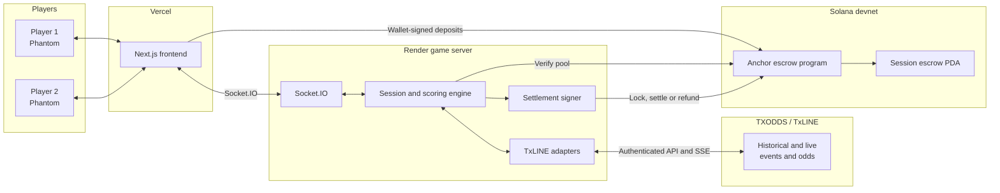

# MatchPot ⚽🏆

> Live, odds-powered prediction battles for the FIFA World Cup.

[**Play the live demo**](https://tx-odds-hack-web.vercel.app/) · [TXODDS / TxLINE](https://txline-docs.txodds.com/documentation/quickstart) · [Solana program](https://explorer.solana.com/address/Diu1knrbYFraN5oSzjEW2RBjRW1obVo2iNz7vHDVrLET?cluster=devnet)

MatchPot turns a football match into a social prediction game between friends. Two players join a session, lock SOL into a shared prize pool and answer in-play questions such as **“Who scores the next goal?”** Correct calls earn points using the TXODDS price captured when the prediction is submitted. At full time, the highest score wins and the application settles the pot automatically through an Anchor program on Solana.

Built at the **TXODDS World Cup Hackathon at Encode Hub** for the consumer and fan experiences track.

## Why MatchPot?

MatchPot uses TXODDS data to create gameplay rather than simply reproduce a scoreboard:

- Historical TxLINE events power accelerated World Cup replays.
- In-running TXODDS prices determine the value of next-goal predictions.
- Goals, cards and corners resolve questions against the real match feed.
- Scheduled fixtures switch automatically to live score and odds streams.
- Prices are captured at submission time, rewarding difficult early calls.

## Demo modes

| Mode                    |            Players | Wallet       | Prize pool                      | Data                               |
| ----------------------- | -----------------: | ------------ | ------------------------------- | ---------------------------------- |
| **Competitive replay**  |                  2 | Phantom      | 0.1 devnet SOL each             | Historical TxLINE events and odds  |
| **Free practice**       | Player vs MatchBot | Not required | None                            | Same replay, questions and scoring |
| **Upcoming live match** |                  2 | Phantom      | Opens 15 minutes before kickoff | TxLINE live score and odds streams |

The demo includes four verified historical fixtures plus the World Cup third-place play-off and final. The selected fixture determines whether MatchPot uses historical or live TxLINE APIs—there is only one application and one startup command.

## How it works

1. The host selects a fixture and creates a session.
2. A friend joins using the four-character code or QR invitation.
3. In competitive mode, both players deposit **0.1 SOL** into a unique escrow PDA.
4. At kickoff, the application verifies the deposits and locks the pool.
5. Players answer timed questions while TXODDS events and prices update the game.
6. At full time, the winner receives the pot. Ties split it; if everyone scores zero, all entries are refunded.

### Scoring

| Question                         | Resolution              |                        Points |
| -------------------------------- | ----------------------- | ----------------------------: |
| Who scores the next goal?        | Next TxLINE goal        | `100 × captured TXODDS price` |
| Which team gets the next card?   | Next yellow or red card |                           150 |
| Which team wins the next corner? | Next corner             |                           150 |

Next-goal prices are capped between **1.05× and 6.00×** so one long-shot call cannot decide the entire match. Questions that remain unresolved at full time are voided.

## Infrastructure



- **Frontend:** wallet connection, fixture selection, predictions, live odds, QR invites and settlement receipts.
- **Game server:** session membership, question scheduling, scoring and winner calculation.
- **TxLINE adapters:** historical replay plus live score and odds streaming.
- **Anchor program:** deposits, kickoff lock, payouts, tie splitting and refunds.

## TXODDS integration

For historical fixtures, MatchPot parses the recorded scores feed into kickoff, goals, cards, corners, half-time and full-time events. It samples in-running odds across the match and replays the combined timeline at an accelerated pace.

Upcoming fixtures use the live score and odds streams directly. MatchPot prefers a dedicated next-goal market when available; otherwise it derives a two-team probability from the demargined in-running 1X2 market, excluding the draw.

## Solana escrow

The reusable Anchor program is deployed on devnet at [`Diu1knrbYFraN5oSzjEW2RBjRW1obVo2iNz7vHDVrLET`](https://explorer.solana.com/address/Diu1knrbYFraN5oSzjEW2RBjRW1obVo2iNz7vHDVrLET?cluster=devnet).

Every session receives a random 32-byte `escrowId`, producing a unique PDA. The host initializes the pool but cannot cancel it after kickoff. A separate application settlement authority locks the escrow and submits the full-time payout selected by the game engine. The program verifies the authority, lock state and winner accounts before moving funds.

Equal-score winners split the pool. Zero-score games refund every player, and partially funded upcoming sessions are refunded if they expire five minutes after kickoff.

> **Trust model:** custody and payout rules are enforced on-chain, while winner calculation is performed by the MatchPot server using TXODDS events. A production version should replace the application signer with oracle-signed or threshold-authorized results before accepting mainnet funds.

## Technology

| Layer          | Technology                        |
| -------------- | --------------------------------- |
| Frontend       | Next.js 15, React 19, TypeScript  |
| Realtime       | Socket.IO                         |
| Sports data    | TXODDS TxLINE APIs and SSE        |
| Wallet         | Solana Wallet Adapter and Phantom |
| Smart contract | Rust and Anchor 0.32              |
| Hosting        | Vercel and Render                 |

## Run locally

```bash
pnpm install
pnpm dev
```

The frontend runs on <http://localhost:3000> and the game server on <http://localhost:3001>. Use two browser profiles for a competitive game, or choose **Practice free vs MatchBot** for a single-browser demo.

Historical replays require TxLINE credentials. If they have not already been created:

```bash
cd packages/server
TXLINE_NETWORK=devnet \
TXLINE_WALLET=/absolute/path/to/solana-keypair.json \
pnpm txline:setup
```

The selected fixture routes to the correct feed automatically. Replay speed can be adjusted with `MS_PER_MINUTE=1500 pnpm dev`.

## Verification

```bash
pnpm typecheck
pnpm --filter @matchpot/web build
```
